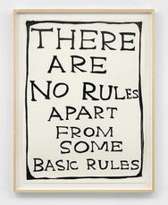

Writing isn’t a test. Even if you ignore all these guidelines, that’s okay — that’s what good editing is all about. It should help you, not hamper your creativity. So write how you feel and SIG Content ([#sig-content](https://gigantic.slack.com/archives/C02NGJTJN)) + SIG Docs ([#sig-docs](https://gigantic.slack.com/archives/C03FYAV8U)) will be there to support, shape your ideas, answer questions and review your content.

In this article, you find guidelines around goals, voice and grammar, the basic knowledge for writing content. For more specific information, please also read our [blog content guide](https://intranet.giantswarm.io/docs/content/blog-content-guide/) or [social media guide](https://intranet.giantswarm.io/docs/content/social-media-guide/).

## How we want to sound

- **Be conversational**

  This isn’t an essay you’ll be graded on. Write how you speak, encourage a two-way conversation.

- **Let the reader be a bit lazy**

  Get to the point and let the article be digestible. This is true for word choice and formatting.

- **Show your personality**

  If you have fun while writing it, the reader will likely have fun while reading it.

- **Think about the finished product**

  Add pictures, diagrams, memes… Think about what someone would tweet about if they read your article.

- **Be generous with knowledge**

  If there’s a helpful link, include it. If you can add a summary (TL;DR), do. We’re not possessive about our knowledge because we have a lot of it.

- **Be nice**

  Write how you would like to be written to. Be cool.

## Goals

While these aren’t exhaustive, with every piece of content, we aim to:

- **Educate**

  Share knowledge on the things we care about.

- **Empower**

  Our colleagues, our partners, our customers.

- **Share our values**

  Our values should be reflected in all that we do.

- **Share what makes us special**

  We’re in the best position to share what makes us special, let’s remember to do just that.

## Voice

Voice means ‘how we want to sound’ so, if someone were to read our content aloud to a hypothetical audience, would they think we are nice enough people, or would they wish we would shut up?

Here are some Dos and Don'ts for you to consider:

<!-- markdownlint-disable no-blanks-blockquote -->

- We are sherpas, you know, the behind-the-scenes experts who help the hero climb up the mountain. We do the technical heavy lifting at work and in language. Try to explain things simply and demystify the confusing stuff.
- It goes without saying, but we’re never condescending or snobby — we bring people in on the joke, we don’t make them the joke.
- Don’t be formal, write like a person. Write as you would speak to a friend.
- Where relevant, start sentences with verbs to keep things punchy.

  > ✔️ Write punchy content by keeping sentences short.

  > ❌ The way to write punchy content is by keeping sentences short.

- Say it simply or don’t say it at all — unless it’s really funny, then that’s okay. If it confuses you a little, it’s going to confuse us a lot.
- Don’t write like a robot, put your heart into it.

## Language and grammar

### Top tips

- Friendly details count. Use contractions:

  > ✔️ it’s

  > ❌ it is

  > ✔️ you’re

  > ❌ you are

  > ✔️ we’re

  > ❌ we are

  > ✔️ let’s

  > ❌ let us

- We are firm believers in the Oxford comma: in a list of three or more items, include a comma before the conjunction. 🇬🇧

  > ✔️ These are the options you have for defining the size of a Kubernetes cluster, choosing the instance types, and automatically scaling the cluster.

  > ❌ These are the options you have for defining the size of a Kubernetes cluster, choosing the instance types and automatically scaling the cluster.

- Other than that, Giant Swarm uses American English across all platforms. 🇺🇸

  > ✔️ center

  > ❌ centre

- Spell out numbers one to ten and use the numerals for the rest.
- Don’t use ellipses (`…`) for drama or emphasis but only to indicate trailing off and only then sparingly. Or used in a bracket to indicate that you’re omitting words from a quote. “She loves working Monday to Friday [...] her boss is reading.”

### Capitalization

This applies to Giant Swarm text on the blog, website, public and internal documentation, and social media. Visual assets are excluded from this rule – they may use [title case](https://en.wikipedia.org/wiki/Title_case)).

To ensure consistency, use sentence-case capitalization. This means capitalizing only the first word of a sentence (excluding proper nouns, brands, services).

- If a sentence begins with a lowercase word, rewrite this sentence if possible.

  > ✔️ Not many people know that adidas is lowercase.

  > ❌ adidas is lowercase can you believe it.

- Don’t use internal capitalization

  > ❌ e-Commerce

- When spelling out acronyms, only capitalize if it’s a proper noun.
- If using a slash, for example `On/Off`, always make the words match: lowercase/lowercase or Uppercase/Uppercase.

### Words to avoid

These are words we try to avoid because they’re clichéd, jargon-y or overly complicated.

- ❌ `utilize`, `leverage` — ✔️ `use` is better
- ❌ `Kubeception`
- ❌ `Hyperconvergence`
- ❌ `guru`, `ninja`, `rockstar` — you get the deal!
- ❌ `ideation` — just say ✔️ `brainstorming`
- Deprecated Giant Swarm terminology
  - ❌ Draughtsman
  - ❌ Giantnetes

### Bias-free communication

| ❌ Bad             | ✔️ Good |
| ------------------ | ------ |
| chairman           | chair, moderator |
| mankind            | humanity, people, humankind |
| mans               | operates, staffs |
| salesman           | sales representative |
| manmade            | manufactured, synthetic |
| manpower           | workforce, staff, personnel, capacity, effort |
| sane (defaults)    | sensible (defaults) |
| guys               | folks/folx |
| he/she and him/her | they/theirs |
