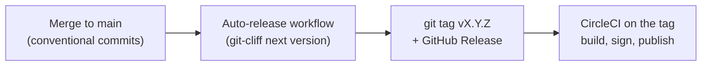
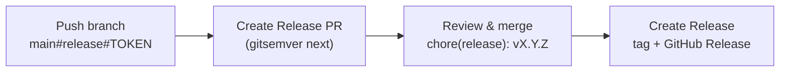
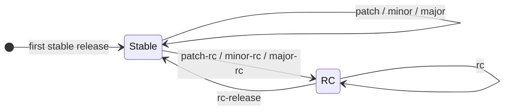
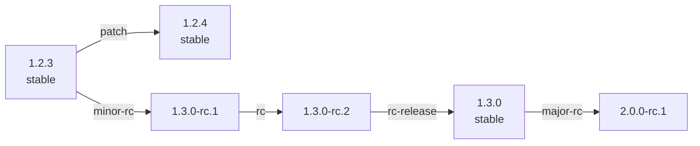

A release of a Giant Swarm software repository produces a git tag, a GitHub Release, and the
artifacts that CircleCI builds and publishes from that tag (a container image, a Helm chart, and/or
CLI binaries). How you *create* a release depends on how the repository's CI is set up.

## Two release models

- **Auto-release (generated CI)** — the default for repositories whose CI is generated from
  [`giantswarm/github`](https://github.com/giantswarm/github) (`gen.ci.generate: true`). There is no
  release command, release branch, or release PR: every merge to `main` computes the next version
  from the [Conventional Commits](https://intranet.giantswarm.io/docs/dev-and-releng/developer-workflow/conventional-commits/)
  in the change and tags it automatically. See [Auto-release](#auto-release-generated-ci-repositories).
- **Branch-push releases (legacy)** — repositories not yet on generated CI
  (`releaseWorkflow: legacy`) release by pushing a specially-named branch, which opens a release PR
  you review and merge. See [Branch-push releases](#branch-push-releases-legacy).

If a repository has a `.github/workflows/zz_generated.auto_release.yaml` and a `cliff.toml`, it is on
auto-release; otherwise it uses the branch-push flow. The
[generated CI pipeline](https://intranet.giantswarm.io/docs/dev-and-releng/ci/circle-ci/) page
describes how that pipeline is generated and what each tag publishes.

## Auto-release (generated CI repositories)

You do not run a release command. To ship a new version:

1. Merge your change to `main` with
   [Conventional Commit](https://intranet.giantswarm.io/docs/dev-and-releng/developer-workflow/conventional-commits/)
   messages. The `semantic-pull-request / Validate PR title` check enforces this on every PR.
2. On merge, the auto-release workflow (`zz_generated.auto_release.yaml`, driven by
   [git-cliff](https://git-cliff.org/) and the repository's `cliff.toml`) computes the next semantic
   version from the commits since the last tag — `fix:` bumps the patch, `feat:` the minor, and a `!`
   or `BREAKING CHANGE:` footer the major — updates `CHANGELOG.md`, and creates the `vX.Y.Z` git tag
   and GitHub Release.
3. The new tag triggers the CircleCI pipeline, which builds, signs, and publishes the artifacts
   (multi-arch image, Helm chart, and/or CLI binaries).



A change that should not produce a release — for example `docs:`, `chore:`, or `ci:` commits with no
`feat:`/`fix:` — simply does not bump the version. Maintenance releases for an older line are cut by
merging to its `release-*` branch, where auto-release runs the same way.

## Branch-push releases (legacy)

Repositories still on the legacy model create a release by **pushing a specially-named branch**. The
CI then computes the next version from the existing tags, opens a release pull request, and — once
you merge it — creates the git tag and the GitHub Release. No local tooling is required beyond `git`.

This flow uses the
[reusable release workflows](https://intranet.giantswarm.io/docs/dev-and-releng/ci/github-workflows/)
and the semVer tagging scheme introduced by the
[semVer-based automatic upgrades RFC](https://github.com/giantswarm/rfc/tree/main/semver-based-automatic-upgrades).
For how to **consume** these tags in Flux `OCIRepository` objects for automatic app upgrades, see
[SemVer-based automatic upgrades](https://intranet.giantswarm.io/docs/dev-and-releng/flux/semver-automatic-upgrades/).

### The tagging scheme

Releases use three semVer-compatible tag forms:

- **Stable** — `X.Y.Z`, e.g. `1.2.3`.
- **Release candidate (RC)** — `X.Y.Z-rc.N`, e.g. `1.3.0-rc.1`. Published as a GitHub pre-release.
- **Dev** — `X.Y.Z-dev.<branch>.<YYYY-MM-DD>.<HH-MM-SS>.h<sha>`, e.g.
  `1.2.4-dev.my-feature.2026-01-27.09-49-59.h1a2b3c4`. These are built **automatically** for every
  commit on a non-`main` branch — you never create them by hand (see [Dev builds](#dev-builds)).

The version is always computed from the highest semVer tag reachable from `HEAD`, using
[`gitsemver`](https://github.com/giantswarm/gitsemver). You only choose _how_ to bump it.

### How a release is created

Releasing is a two-step, reviewable flow:

1. **Push a release branch** named `<base>#release#<token>` (the base is usually `main`). You push
   your current `HEAD` to that branch name — the branch does not need to exist beforehand:

   ```bash
   git push origin HEAD:main#release#patch
   ```

2. The **Create Release PR** workflow runs `gitsemver next <token>`, prepares the changelog and chart
   metadata, and opens a `chore(release): vX.Y.Z` pull request.

3. **Review and merge** that PR. The **Create Release** workflow then creates the `vX.Y.Z` git tag,
   publishes the GitHub Release (a pre-release for RC tags), bumps `pkg/project/project.go` if
   present, and — for stable major/minor releases — creates a `release-vX.Y.x` maintenance branch.



### Release commands

The last segment of the branch name is the **bump token**. The resulting version depends on the
token and on the most recent reachable tag:

| Goal                 | Token        | Command                                        | Example: base → result      |
| -------------------- | ------------ | ---------------------------------------------- | --------------------------- |
| Patch release        | `patch`      | `git push origin HEAD:main#release#patch`      | `1.2.3` → `1.2.4`           |
| Minor release        | `minor`      | `git push origin HEAD:main#release#minor`      | `1.2.3` → `1.3.0`           |
| Major release        | `major`      | `git push origin HEAD:main#release#major`      | `1.2.3` → `2.0.0`           |
| Start a patch RC     | `patch-rc`   | `git push origin HEAD:main#release#patch-rc`   | `1.2.3` → `1.2.4-rc.1`      |
| Start a minor RC     | `minor-rc`   | `git push origin HEAD:main#release#minor-rc`   | `1.2.3` → `1.3.0-rc.1`      |
| Start a major RC     | `major-rc`   | `git push origin HEAD:main#release#major-rc`   | `1.2.3` → `2.0.0-rc.1`      |
| Next RC              | `rc`         | `git push origin HEAD:main#release#rc`         | `1.3.0-rc.1` → `1.3.0-rc.2` |
| Promote RC to stable | `rc-release` | `git push origin HEAD:main#release#rc-release` | `1.3.0-rc.2` → `1.3.0`      |

To release an exact version in one step, push the explicit form `main#release#vX.Y.Z` (for example
`git push origin HEAD:main#release#v1.4.0`). Prefer the bump tokens above for day-to-day work.

### Valid RC transitions

The bump tokens move a repository between **stable** and **RC** states. The token you may use depends
on whether the latest tag is stable or an RC:



A concrete walk-through, starting from the stable tag `1.2.3`:



So a typical RC cycle is: start a series with `minor-rc` (`1.3.0-rc.1`), iterate with `rc`
(`1.3.0-rc.2`, …), then finalize with `rc-release` (`1.3.0`).

### Rules and constraints

- `patch`, `minor`, `major` and the RC starters `patch-rc` / `minor-rc` / `major-rc` require the
  latest tag to be **stable**. If the latest tag is an RC, they fail — use `rc` to bump the counter
  or `rc-release` to finalize the series first.
- `rc` and `rc-release` require the latest tag to be an **RC**, and cannot start from an empty tag
  history. Begin a new RC series with `patch-rc`, `minor-rc`, or `major-rc`.
- The branch **prefix** selects the base branch: `main`, or a `release-vX.Y.x` maintenance branch for
  patching an older line (e.g. `release-v1.2.x#release#patch`).
- RC releases are published as GitHub **pre-releases**. A stable major or minor release also creates
  a `release-vX.Y.x` maintenance branch so later patches can be cut from that line.
- The changelog must contain an entry for the target version; the release-PR workflow prepares it for
  you, following our
  [conventional commits](https://intranet.giantswarm.io/docs/dev-and-releng/developer-workflow/conventional-commits/).

### Dev builds

Every commit on a branch other than `main` is built and tagged automatically with a `…-dev.…` tag —
no command needed. The tag embeds the branch name, the commit's UTC timestamp, and its short SHA, so
dev builds sort chronologically per branch and trace back to a commit. To skip automatic builds for a
branch (saving CI and registry resources), prefix its name with `nobuild/`. See
[`gitsemver`](https://github.com/giantswarm/gitsemver) for the exact format.

### Rolling back

If a release misbehaves and "fix and roll forward" is not viable, pin the affected deployment to a
known-good version — either narrow the accepted semVer range so the bad version is excluded, or (for
GitOps-managed objects) pause the owning `Kustomization` and force a specific version. See the
[emergency rollback section of the RFC](https://github.com/giantswarm/rfc/tree/main/semver-based-automatic-upgrades#emergency-rollback)
for details.
