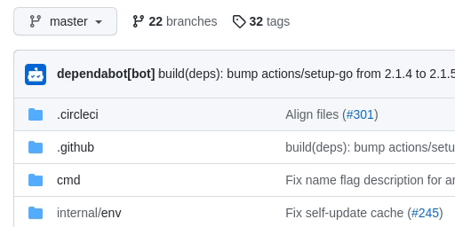
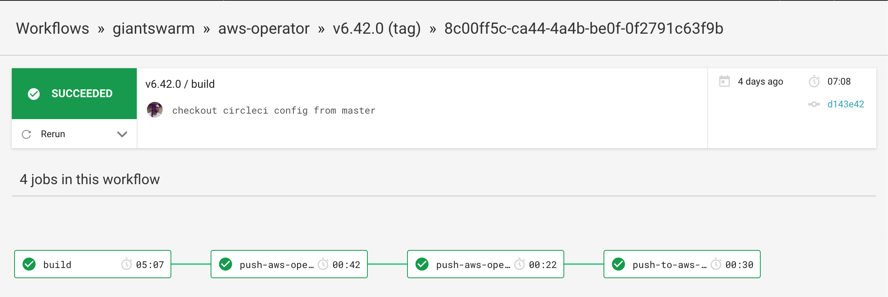

## Recording

There is a recording captured on 2020/06/22 which is complementary to this
documentation. It can be found [here][video].

[video]: https://drive.google.com/file/d/131rkTO8lk8J0NSqqO4hkBEqySzlkX3TM/view

## Ensure GitHub workflows


If you don't want to add the project to `giantswarm/github`,
make sure GitHub workflows for creating a new release exist and they are up to
date.

1. Install the newest version of `devctl` with `GO111MODULE=on go get
   github.com/giantswarm/devctl`.
2. Go to the top level of the git repository and run `devctl gen workflows`.
3. Create a PR with changes in ` .github/workflows/` directory. This PR can be
   merged without approval.

After it's merged, workflows used to create release PR and create git tag and
GitHub release are all set up.

## Create release PR

Once workflows are ready, it is time to create release branch. The name
of the branch is important and it must follow this convention:

```
${BASE}#release#v${VERSION}
```

Where:

- `BASE` - is the name of the base branch for release PR. Usually it is
  `master` or `main`.
- `VERSION` - either `major`, `minor`, `patch` or a specific version that is going to be created for the release.

Example:

```
git checkout master
git pull origin master
git checkout -b master#release#v1.2.3
git push origin master#release#v1.2.3
```

It is also possible to create the branch using the GitHub UI



After a while (around 1 minute) there should be a release PR created for the
branch and you should be assigned. This PR will update `CHANGELOG.md` file and
if it exists `project.go` file. There should be not extra work required for
this PR apart from requesting reviewers.

If there are new commits in `BASE` branch that you want to integrate you can
simply merge into the release branch or rebase it and push:

``` sh
git checkout master#release#v1.2.3

# merge
git merge master
git push

# or rebase
git rebase master
git push --force
```

If something **goes wrong** you can always delete the branch in origin and push
it again:

``` sh
# delete the branch / close PR
git push --delete origin master#release#v1.2.3

# if you need to refresh it
git checkout master#release#v1.2.3
git reset --hard master

# push it again
git push origin master#release#v1.2.3
```

## Merge the release PR

After the release PR is merged, there will be a git tag and GitHub release created
automatically by the GitHub workflow.

## Check CI for success

The CI will take care of building and deploying this new version to all
installations. The full architecture diagram for CI process can be found
[here](https://intranet.giantswarm.io/docs/dev-and-releng/ci/architecture).

Check that CI workflow executes successfully, e.g.
https://circleci.com/gh/giantswarm/aws-operator

You should get something like this:


At this point, an operator with version v6.42.0 should be installed in all MCs.

## Craft a new release if needed

If the released App is a unique App then no further action is needed. It should
be deployed to specific provider installations once CI successfully finishes
the tag build.

If this App is a part of Giant Swarm release, then a new release needs
to be created. [Details can be found here]().
