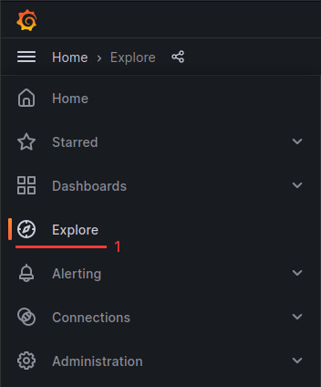

## Context

Logs, which are records of events and activities generated by systems and applications which serve as a rich source of information for administrators, developers, and security professionals. The ability to search through logs is essential to help with troubleshooting, debugging by looking through a detailed history of events, errors and warnings. It is also a valuable source of information in context of performance monitoring, security and compliance.

This guide provide you with the basic to get started with exploring Logs using powerful capabilities brought by Grafana and Loki.


## How to access Logs ?

* Open your installation's Grafana
  * via UI: https://docs.giantswarm.io/getting-started/observability/grafana/access/
  * via CLI (giantswarm only): `opsctl open -i myInstallation -a grafana`

1. Go to `Explore` item in the `Home` menu
2. Select `Loki` datasource on the top left corner
3. Choose how to build your queries:
   * `builder` and play with the dropdowns to build your query
   * `code` to write your query using [LogQL](https://grafana.com/docs/loki/latest/logql/)




### Live Mode

Live mode feature of Grafana Loki is not available at the moment because of multi-tenancy (c.f. https://github.com/grafana/loki/issues/9493) 😢

## LogQL basics

### Query anatomy

```goat
{ installation="myInstallation", pod=~"k8s-api-server-ip-.*" } |= “unable to load root certificate”
|                                                            |  | |                               |
.-----------------------------+------------------------------.  | .---------------+---------------.
                              |                                 |                 |
                              v                                 v                 v
                     log stream selectors               filter operator    filter expression
```

### Log stream selectors

Used to filter the log stream by labels

```
=  : equals
!= : not equals
=~ : regex matches
!~ : regex does not match
```

### Filter operators

Used to filter text within the log stream

```
|= : contains
!= : does not contain
|~ : regex matches
!~ : regex does not match
```


## Example of useful LogQL queries

Here are a few LogQL queries you can test and play with to understand the syntax.

### Basic pod logs

* Look for all `k8s-api-server` logs on `myInstallation` MC:
```
{installation="myInstallation", cluster_id="myInstallation", pod=~"k8s-api-server-ip-.*"}
```

* Let's filter out "unable to load root certificate" logs:
```
{installation="myInstallation", cluster_id="myInstallation", pod=~"k8s-api-server-ip-.*"} != "unable to load root certificate"
```

* Let's only keep lines containing "url:/apis/application.giantswarm.io/.*/appcatalogentries" (regex):
```
{installation="myInstallation", cluster_id="myInstallation", pod=~"k8s-api-server-ip-.*"} |~ "url:/apis/application.giantswarm.io/.*/appcatalogentries"
```

### json manipulation

* With json logs, filter on the json field `resource` contents:
```
{installation="myInstallation", cluster_id="myInstallation", pod=~"prometheus-meta-operator-.*"} | json | resource=~"remotewrite.*"
```

* from the above query, only keep field `message`:
```
{installation="myInstallation", cluster_id="myInstallation", pod=~"prometheus-meta-operator-.*"} | json | resource=~"remotewrite.*" | line_format "{{.message}}"
```
### Audit logs

* Get audit logs using json filter to get only the ones owned by a specific user

```
{cluster_id="myCluster",scrape_job="audit-logs"} |= `` | json | user_username=`fernando@giantswarm.io`
```

__Note__: In json filter to access nested properties you use `_` for getting a child property as the example above (user.username -> user_username).

### System logs

* Look at `containerd` logs for node `10.0.5.119` on `myInstallation` MC:
```
{installation="myInstallation", cluster_id="myInstallation", systemd_unit="containerd.service", node_name="ip-10-0-5-119.eu-west-1.compute.internal"}
```

### Metrics queries

You can also generate metrics from logs.

* Count number of logs per node
```
sum(count_over_time({installation="myInstallation", cluster_id="myInstallation", node_name=~"ip-.*"}[10m])) by (node_name)
```

* Top 10 number of log lines per scrape_job, app, component and systemd_unit
/!\ This query is heavy in terms of performance, please be careful /!\
```
topk(10, sum(rate({cluster_id="myCluster"}[5m])) by (cluster_id, scrape_job, app, component, systemd_unit))
```

* Rate of logs per syslog identifier
/!\ This query is heavy in terms of performance, please be careful /!\
```
sum(rate({cluster_id="myCluster", scrape_job="system-logs"}[5m] |= `` | json)) by (SYSLOG_IDENTIFIER)
```
