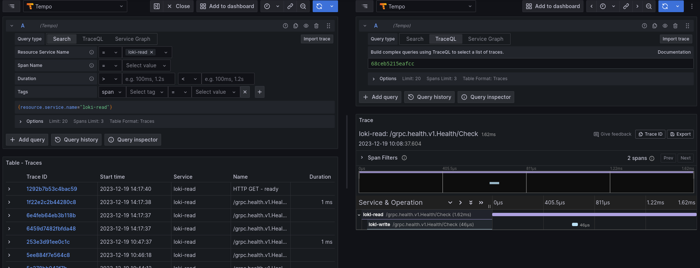

This document's purpose is to explain our current tracing capabilities and experimentation that we are running for Atlas and for some customers.

## Table of contents

* [Definitions](#definitions)
* [Grafana Tempo](#grafana-tempo)
* [Autoinstrumentation with eBPF](#autoinstrumentation-with-ebpf)
* [Future](#future)

## Definitions

To have a good understanding of distributed tracing, reading the [opentelemetry manual](https://opentelemetry.io/docs/concepts/) is strongly recommended.

## Grafana tempo

As an experiment for customers and ourselves, we started to allow the use of Grafana Tempo on Vintage AWS management clusters.

Grafana Tempo is a trace backend used to store distributed traces and is meant to be accessed by grafana.
It can be deployed on demand by customers and internal teams alike if needed.

### Accessing Tempo

Open grafana on the installation you're interested in and go to the `Explore` section. There, you can use the `Tempo` datasource and start going through traces.



### Inner workings

Tempo currently does not work with multi-tenancy so traces are shared between all grafana users.

Tempo is deployed in microservice mode and it can ingest traces either through the Tempo gateway or the Tempo distributor. The main difference between the two is that the tempo-gateway only supports http(s) communication whereas the distributor supports also gRPC.

For our initial experiment, we decided to work without any "tracing agent" like the opentelemetry-collector to reduce our footprint and effort but this might come in the future.

### On-demand

It can be enabled at the installation level like so https://github.com/giantswarm/config/blob/4e01cbc6de32420d111d78e0e278e72a31e5daba/installations/gaia/config.yaml.patch#L9

### Ingesting traces

#### Loki

If tracing is enabled at the installation level, Loki running on the MC is configured to send its traces to Tempo

### Prometheus

- To enable tracing for Prometheus, you should set the following configuration on the Prometheus CR:

```yaml
spec:
  tracingConfig:
    clientType: http
    endpoint: tempo-gateway.tempo.svc:80 # Tempo service on the MC
    insecure: false
    samplingFraction: "0.5" # sampling of 1/2 so we only send half of the traces
```

## Autoinstrumentation with eBPF

Distributed tracing is not a feature that comes by default in applications. They need to be instrumented by opentelemetry SDKs to be able to export traces.

But there are cases where it is not possible to get traces from applications (blackbox or vendored applications, languages not equipped with opentelemetry SDKs like R). This is a really big blind spot in distributed tracing. The good news is that we can now rely on eBPF to get some basic traces from our applications. After experimenting with a few different tools like odigos, we tried out [Grafana Beyla](https://github.com/grafana/beyla) after it was released in version 1.0.0 and it looks to be the most mature solution (not relying on a lot of things that can fail and actually exporting traces from apps)

We ran it as an experiment for a customer but if the need arises, the following shows how we deployed it to trace an application written in R alongside an opentelemetry collector:

```yaml
apiVersion: v1
kind: Namespace
metadata:
  labels:
    app: beyla
  name: beyla
---
apiVersion: v1
kind: ConfigMap
metadata:
  labels:
    app: beyla
  name: beyla-config
  namespace: beyla
data:
  beyla-config.yml: |
    grafana:
      oltp:
        submit: ["traces"]
    otel_traces_export:
      sampler:
        name: parentbased_traceidratio
        arg: 1
    discovery:
      services:
      - namespace: citadel
        open_ports: 2000-15000
---
apiVersion: v1
kind: ServiceAccount
metadata:
  name: beyla
  namespace: beyla
  labels:
    app: beyla
---
apiVersion: apps/v1
kind: DaemonSet
metadata:
  name: beyla
  namespace: beyla
  labels:
    app: beyla
spec:
  selector:
    matchLabels:
      app: beyla
  template:
    metadata:
      labels:
        app: beyla
    spec:
      serviceAccountName: beyla
      tolerations:
      - key: risk-perf
        operator: Exists
      - key: importer
        operator: Exists
      - key: internal-raptor
        operator: Exists
      hostPID: true # Require to access the processes on the host
      nodeSelector:
        kubernetes.io/os: linux
      volumes:
        - name: beyla-config
          configMap:
            name: beyla-config
      containers:
        - name: autoinstrument
          image: grafana/beyla:1.0
          command: ["/beyla", "--config=/config/beyla-config.yml"]
          securityContext:
            runAsUser: 0
            privileged: true # Alternative to the capabilities.add SYS_ADMIN setting
          env:
            - name: OTEL_EXPORTER_OTLP_ENDPOINT
              value: "http://my-opentelemetry-collector.default.svc:4317"
            - name: BEYLA_LOG_LEVEL
              value: DEBUG
          volumeMounts:
          - mountPath: /config
            name: beyla-config
---
kind: ClusterRoleBinding
apiVersion: rbac.authorization.k8s.io/v1
metadata:
  name: beyla:privileged
  namespace: beyla
subjects:
- kind: ServiceAccount
  name: beyla
  namespace: beyla
roleRef:
  kind: ClusterRole
  name: privileged-psp-user
  apiGroup: rbac.authorization.k8s.io
```

## Future

Ideas for the future:

- Deploy tempo by default on all MCs
- Opentelemetry agent in all clusters either using opentelemetry-operator, opentelemetry-collector or grafana-agent
