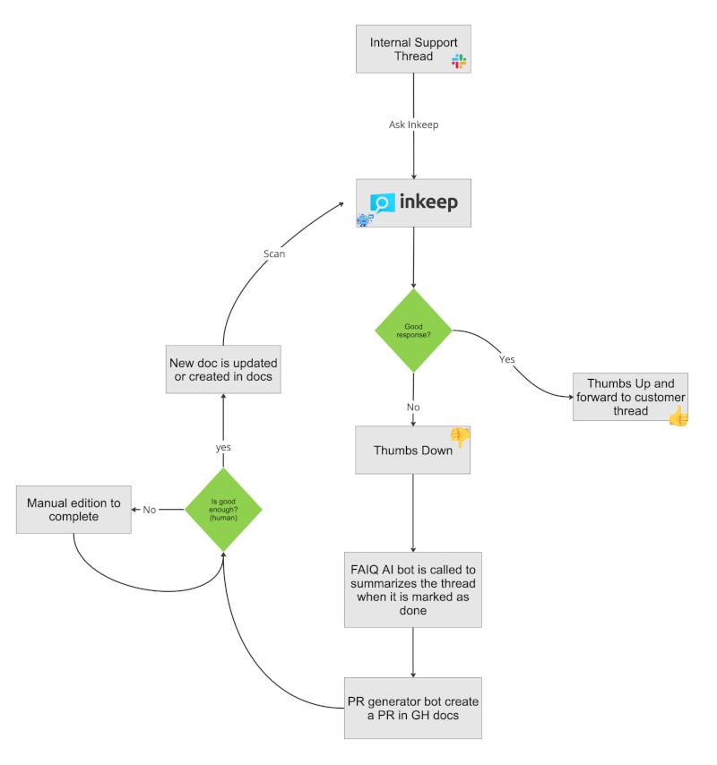
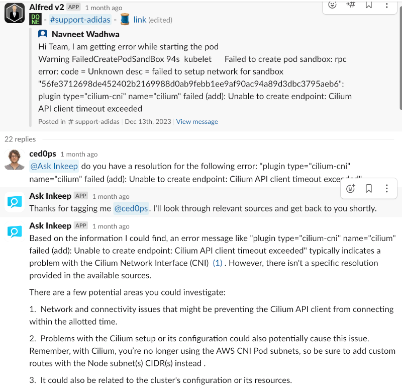
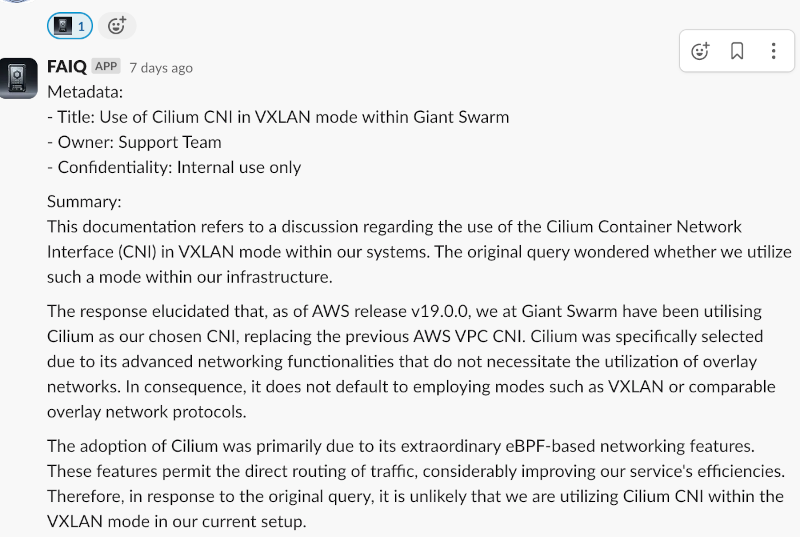
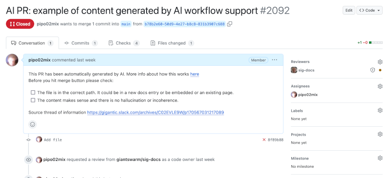

## Why do we need this?

We have seen that multiple customers have asked similar questions repeatedly. Ideally, we'd put everything in our docs so we can support and profit as the main source of information. However, every reply to an individual question requires some research and thus time, considering the huge amounts of content our docs have. The `AI support workflow` aims to solve this pain by allowing our support colleagues to ask questions to a GPT (called `Inkeep`) and obtain a decent quality, correct answer.

## How this works?

We have a workflow that could look like

Here we see there is a bot, called `@Ask Inkeep`, which is [automatically called for every new support thread by a dummy reply bot](https://github.com/giantswarm/slack-replier). The Inkeep bot will use OpenAI technology to query a custom GPT for an answer that has been trained on our official documentation.

The AI bot will query the trained model and reply in the same thread. The bot also asks for feedback on the response which is important to increase accuracy, over time. In case the response is good, it can be used in a reply to the customer directly (potentially one day we can put this in front of the customer). In case it is not, then we ask the owner team to give us a correct answer, as usual. There may still be some discussion till we mark the support thread as done.

At this point, when we have clarified the thread and satisfied the customer, we could run [FAIQ](https://github.com/giantswarm/faiq) to get a good summary of what we have been done in the support request (adding `:support-recipe` icon). It will go through the thread and output a good summary, only taking the content from humans, and asking Open AI for a good summary following some format. Voila, we have markdown response with what has been done.

We could end here but to close the circle ideally we put back the learnt lesson into our docs so AI bot will have a better answer next time. In order to do that we have created a [little bot](https://github.com/giantswarm/pr-generator/) that listens to an icon (`pr-github-open`) and pushes the message (apply it to the markdown summary please) to our docs automatically. After the team in question reviews the PR we can merge and Inkeep will later scrape it and include it in the LLM database.

## Further links

- [Inkeep Official docs](https://docs.inkeep.com/overview/getting-started)
- [Slack Replier repo](https://github.com/giantswarm/slack-replier)
- [FAIQ repo](https://github.com/giantswarm/faiq)
- [PR generator repo](https://github.com/giantswarm/pr-generator)
