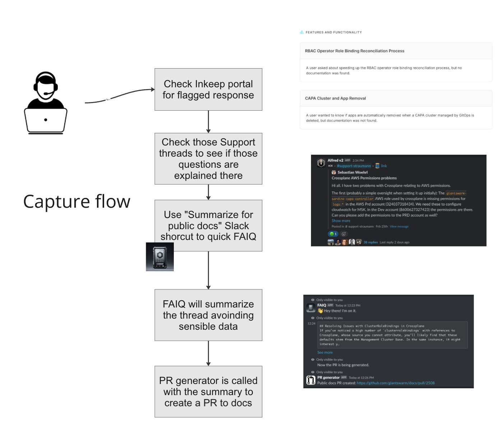

## Why are we doing this?

Main reasons:

- We tend to answer a customer request multiple times.
- We spend time and effort to find a solution but we rarely update our docs with the findings.

The main idea is to use AI to help us answer customer requests at the same time we capture the knowledge and put it back into our docs without big effort.
## How this works?

We can summarize the workflow in two steps:

1. Assistant flow:

Our dummy [Slack Replier bot](https://github.com/giantswarm/slack-replier) listens to Slack for support questions and triggers calls to [Inkeep](https://portal.inkeep.com/) to get an answer. Inkeep returns a `confidence` score which we use to decide if we can use the answer or not. The bot will only reply if the confidence is high (`very_confident`).

2. Capture flow:

The capture flow works in parallel with the assistant flow. Inkeep offers [reports](https://portal.inkeep.com/giantswarm/projects/cln8dq1a20003s60159pi4gv6/reports) and [chat sessions with `documentation gap` enabled](https://portal.inkeep.com/giantswarm/projects/cln8dq1a20003s60159pi4gv6/chat/chat-sessions?filters={%22firstMessageTime%22:%2230d%22,%22isDocumented%22:%22no%22}) where we can find support threads where there was no correct answer by the bot. Then we can verify if there is a gap and check the Slack support thread contains more or less the information to fill that gap. When it is the case, we use `Summarize for public docs` Slack shortcut to generate a summary and a pull request with the changes.
That Slack shortcut is powered by [FAIQ](https://github.com/giantswarm/faiq) and [PR generator](https://github.com/giantswarm/pr-generator). FAIQ receives the Slack action and retrieve all messages of the thread. Then it asks Chat GPT to have a good summary excluding any credentials or sensitive information. With that summary asks PR generator to find a location in the docs to put the summary and generate a PR with the changes.

Example of [pull request created by the flow](https://github.com/giantswarm/docs/pull/2499/files).

## Further links

- [Inkeep Official docs](https://docs.inkeep.com/)
- [Slack Replier repo](https://github.com/giantswarm/slack-replier)
- [FAIQ repo](https://github.com/giantswarm/faiq)
- [PR generator repo](https://github.com/giantswarm/pr-generator)
